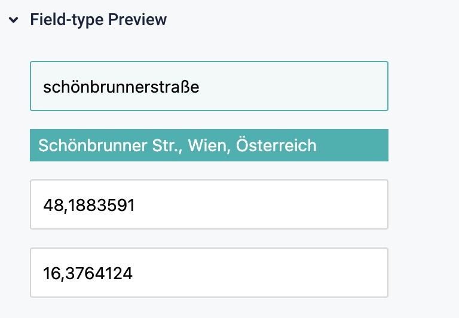
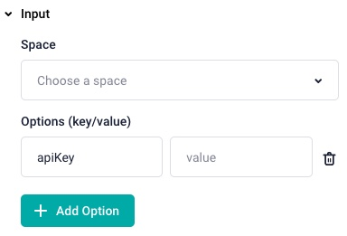

# Storyblok Google Maps Field type

A Storyblok Google Maps custom Field. You can search for addresses via the google maps geocoding API. If you click on one of the search results, latitude and longitude of the address will be added.

## Preview



## Prerequisits

- Partner Portal needed
- Google Maps apiKey for Geocode api
- [yarn]((https://yarnpkg.com/) Package manager

## Usage

- create a custom storyblok Field (Partner Portal required) with the name `google-map-locations`. You can checkout how this can be done here:
  - https://www.storyblok.com/docs/plugins/plugin-create-a-new-plugin
- run `yarn && yarn build` from projects root.
- copy generated code of `dist/export.js` into your custom field editor.
- add `apiKey` as an option under `Input` on your custom field
  
- save & publish the custom field
- Add the custom field on one of your spaces

## Developemnt Mode

### Project setup

```
yarn
```

#### Compiles and hot-reloads for development

```
yarn dev
```

In the browser, you will see the white screen with the following error in the console:
```
[Vue warn]: Error in created hook: "SyntaxError: Failed to execute 'postMessage' on 'Window': Invalid target origin 'null//app.storyblok.com' in a call to 'postMessage'."

DOMException: Failed to execute 'postMessage' on 'Window': Invalid target origin 'null//app.storyblok.com' in a call to 'postMessage'.
```
But don't worry, this project is just a template and only works as part of the storyblok app. See:
https://www.storyblok.com/docs/plugins/enable-local-dev-mode

### Compiles and minifies for production
```
yarn build
```

### Lints and fixes files
```
yarn lint
```
